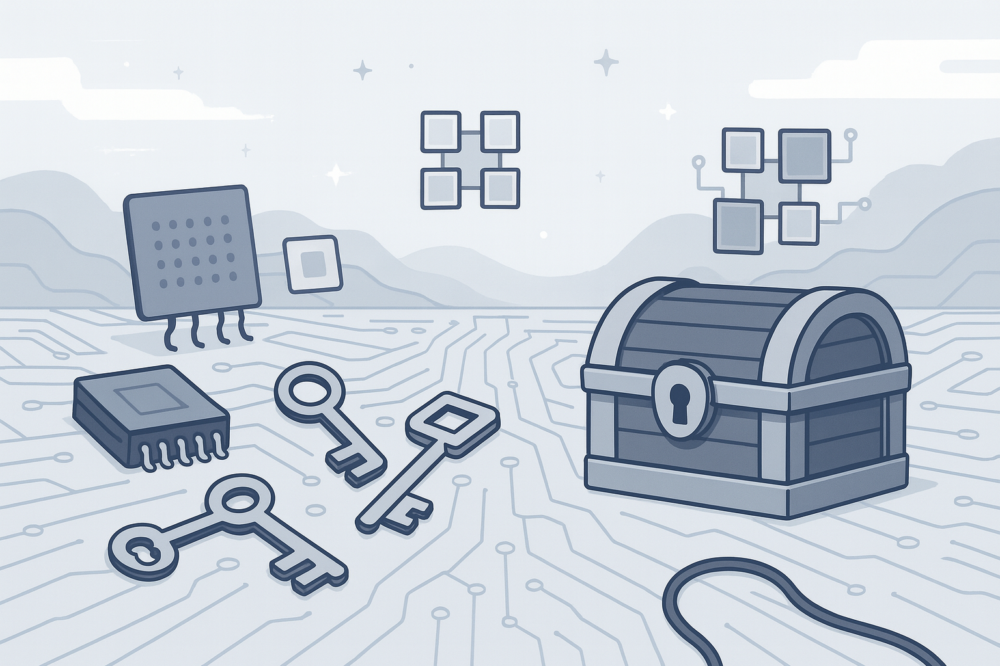

# Keys & Caches



Welcome to **Keys & Caches** — the fastest way to run PyTorch models on cloud GPUs with automatic profiling and performance insights.

---

## 📚 Documentation Overview

This documentation will help you get started with Keys & Caches and make the most of its powerful features for GPU-accelerated machine learning.

---

## What is Keys & Caches?

Keys & Caches is a command-line tool that makes it effortless to run PyTorch models on high-performance cloud GPUs. With just one command, you can:

* 🚀 **Submit jobs to cloud GPUs** — Access A100, H100, and L4 GPUs instantly
* 📊 **Get automatic profiling** — Detailed performance traces for every model forward pass
* 🔍 **Debug performance bottlenecks** — Chrome trace format for visual analysis
* ⚡ **Stream real-time logs** — Watch your training progress live
* 💰 **Pay only for what you use** — No idle time charges

---

## Key Features

### 🎯 One-Command Deployment

```bash
# Run any PyTorch script on cloud GPUs
kandc python infer.py --model-size large --epochs 100
```

---

### 📈 Automatic Model Profiling

```python
from kandc import capture_model_class

@capture_model_class(model_name="MyModel")
class MyModel(nn.Module):
    # Your model automatically gets profiled!
```

---

### 🔧 Simple Command Formats

```bash
# Two command formats:
kandc python script.py --script-args                                  # Interactive
chisel --app-name job --gpu H100:4 -- python script.py --script-args  # Separator
```

---

## Who Should Use Keys & Caches?

### 🧑‍🔬 Machine Learning Researchers

* Quickly test models on powerful GPUs without infrastructure setup
* Get detailed performance profiles to optimize model architectures
* Scale experiments from 1 to 8 GPUs seamlessly

### 🏢 ML Engineers & Data Scientists

* Accelerate training jobs without managing cloud infrastructure
* Debug performance issues with automatic profiling
* Iterate faster with real-time progress monitoring

### 🎓 Students & Educators

* Email us at **[founders@herdora.com](mailto:founders@herdora.com)** for free credits!
* Access high-end GPUs for coursework and research
* Learn about model optimization with built-in profiling tools
* Focus on ML concepts, not DevOps complexity

### 🚀 Startups & Small Teams

* Get enterprise-grade GPU access without upfront costs
* Scale compute resources based on actual needs
* Streamline ML workflows from development to production

---

## Why Choose Keys & Caches?

* 🚀 **Instant Access** — No account setup, no credit cards, no waiting. Install and run immediately.
* 💡 **Built for ML** — Purpose-built for PyTorch with automatic model profiling and optimization insights.
* 🎯 **Developer-Friendly** — Simple CLI that works with your existing code. No code changes required.
* 📊 **Performance-First** — Every job includes detailed performance traces to help you optimize your models.
* 💰 **Cost-Effective** — Pay only for actual GPU time. No idle charges, no minimum commitments.

---

## Ready to Get Started?

👉 Jump to the **[Getting Started Guide](https://www.keysandcaches.com/docs)** to install Keys & Caches and run your first GPU job in under 5 minutes!

---

## Quick Example

Here’s how easy it is to run a PyTorch model on cloud GPUs:

```python
# your_model.py
import torch
import torch.nn as nn
from kandc import capture_model_class

@capture_model_class(model_name="SimpleModel")
class MyModel(nn.Module):
    def __init__(self):
        super().__init__()
        self.linear = nn.Linear(784, 10)
    
    def forward(self, x):
        return self.linear(x)

# Train your model...
model = MyModel()
x = torch.randn(32, 784)
output = model(x)  # This gets automatically profiled!
```

```bash
# Run on cloud GPUs with one command
kandc python your_model.py
```

That’s it! Your model runs on high-performance GPUs with automatic profiling. 🎉
